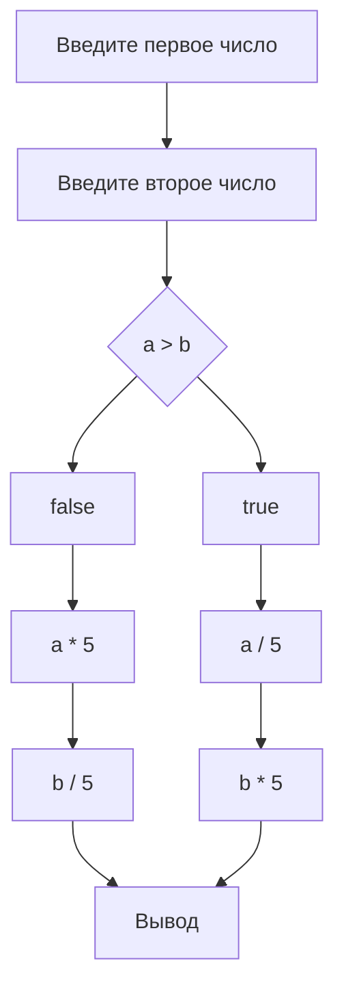

#

Задание: Составить блок-схему и программу, по которой меньшее из двух чисел будет умножено на пять, а
большее разделено на пять.

Решение:

```python
a = int(input("Введите первое число: "))
b = int(input("Введите второе число: "))
if a > b:
    print(a / 5)
    print(b * 5)
else:
    print(a * 5)
    print(b / 5)
```

Для отображения блок-схемы в markdown-файле используется язык [mermaid](https://mermaid-js.github.io/mermaid/#/) (Для визуализовации можно открыть на [сайте](https://mermaid.live/))


